<picture>
  <source media="(prefers-color-scheme: dark)" srcset="dark.svg">
  <source media="(prefers-color-scheme: light)" srcset="light.svg">
  
</picture>


<div align="center">


📍 **Pune, Maharashtra, India** &nbsp;•&nbsp; 🎓 **B.E. Computer Science** &nbsp;•&nbsp; 💼 **Sr. Web Developer @ The Brand Bugzz**


</div>


## 🚀 About Me

I'm a results-driven **Full Stack Web Developer** with 2+ years of professional experience designing, developing, and deploying scalable web applications, RESTful APIs, and secure payment platforms. I've delivered **30+ projects** across Fintech, Education, E-commerce, Healthcare, Real Estate, and Corporate domains — consistently improving performance, security, and user experience.

```yaml
name: Ketan Patil
role: Full Stack Web Developer
location: Pune, Maharashtra, India
current_focus: "Building scalable platforms @ The Brand Bugzz"
currently_exploring: [React Ecosystem, Technical SEO, Microservices]
fun_fact: "I debug PHP with one hand and design UIs with the other 😄"
```

<br>

## 🛠️ Tech Stack

<div align="center">


<br><br>


</div>


## 💡 Featured Projects

<table>
<tr>
<td width="50%" valign="top">

### 💰 Erupaiya
Digital wallet application supporting **BBPS, DMT & UPI**
- ⚡ 5,000+ monthly transactions
- ✅ 99.8% system reliability
- 🔧 `CodeIgniter 4` `PHP` `MySQL`

</td>
<td width="50%" valign="top">

### 📰 The Public Matters
Real-time news & public debate platform
- 💬 Live discussion rooms via WebSockets
- 🔐 JWT + Redis-backed auth
- 🔧 `React` `TypeScript` `Redis` `CodeIgniter 4`

</td>
</tr>
<tr>
<td width="50%" valign="top">

### 🧑‍💼 HR & Payroll Management System
Internal HRMS used by 30+ employees
- 📋 Attendance, leave & payroll workflows
- 🔐 Role-based access control
- 🔧 `CodeIgniter 4` `PHP` `MySQL`

</td>
<td width="50%" valign="top">

### 🌐 TBBV2 (BrandBugzz)
Full-stack marketing agency platform
- 📈 Technical SEO + Core Web Vitals
- 🗺️ Dynamic sitemap + JSON-LD schema
- 🔧 `React` `TanStack Router` `CodeIgniter 4`

</td>
</tr>
<tr>
<td width="50%" valign="top">

### 🎓 Techfreshers.org LMS
Learning management system, 1,000+ active users
- 🎥 Zoom / Google Meet integration
- 📜 Automated certification
- 🔧 `CodeIgniter 4` `PHP` `MySQL` `JS`

</td>
<td width="50%" valign="top">

### 🚗 Vehicle Registration System
Automated RC verification solution
- ⏱️ 90% faster processing time
- 🔧 `PHP` `RC Verification API`

</td>
</tr>
</table>


## 📊 GitHub Stats

<div align="center">


</div>

## 🏆 Trophies

<div align="center">

</div>


## 🔗 Connect With Me

<div align="center">

[](https://www.linkedin.com/in/ketan-patil-webdeveloper/)
[](https://github.com/Mrketan)
[](https://ketanpatil-phi.vercel.app/)
[](mailto:patilketan1303@gmail.com)

<br><br>

<sub>⚡ Available for freelance & full-time opportunities &nbsp;•&nbsp; Notice period: 30 days</sub>

</div>


